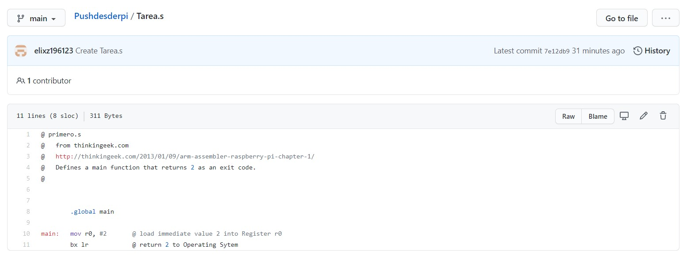
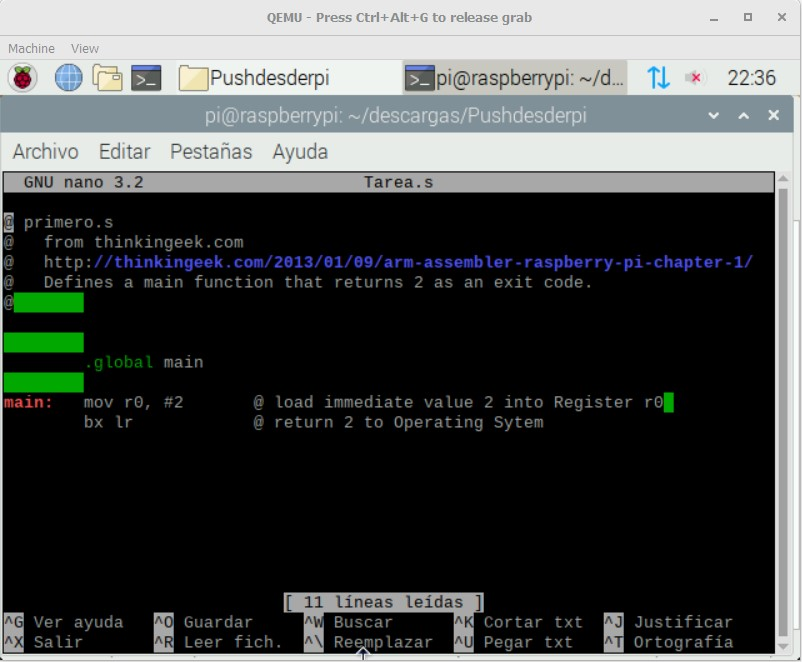
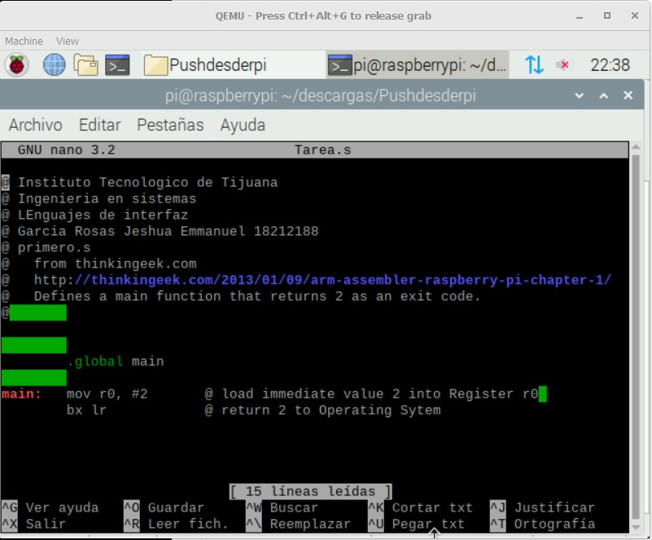
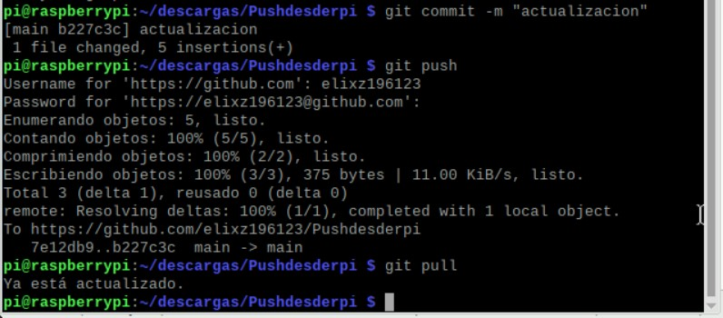
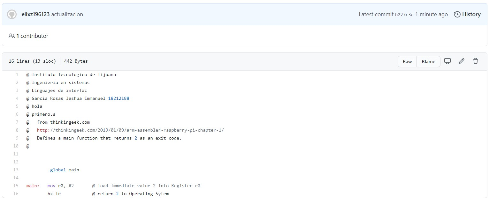

# 3.2.-Usando-GITHub-CLI-para-subir-archivos-desde-la-RPI-o-cualquier-otro-cliente-por-comandos.

### Clonamos el repositorio con el siguiente codigo a nuestro quemu

### Añadimos algunos datos a nuestro archivo

### Hacemos commit, push y pull en ese orden

### y vemos los cambios en nuestro github

